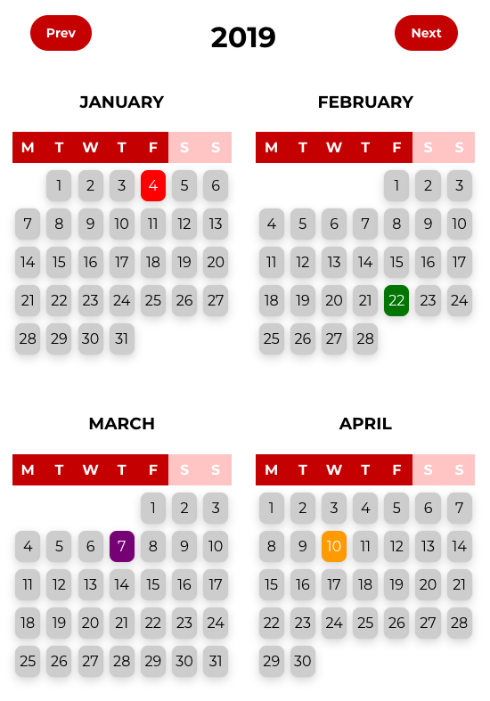
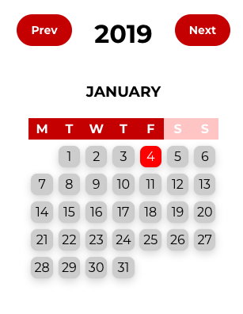
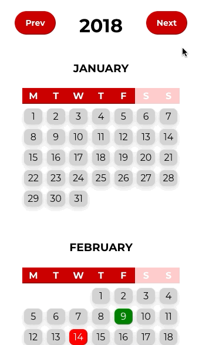
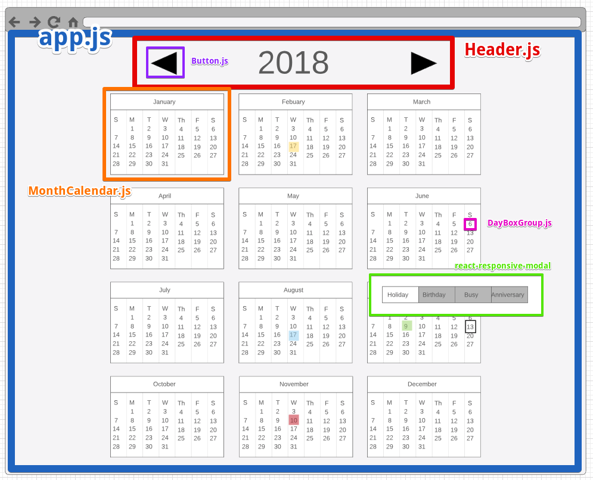
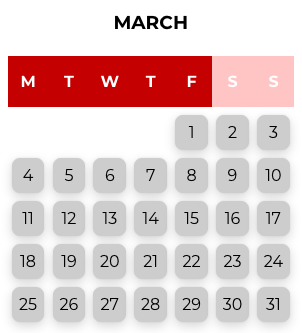
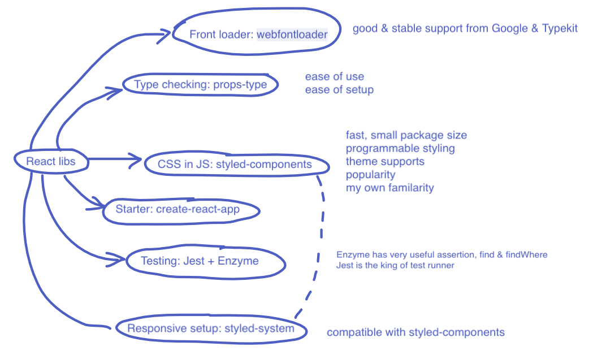
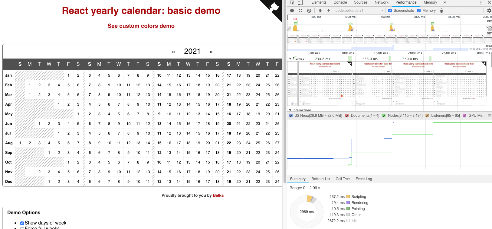
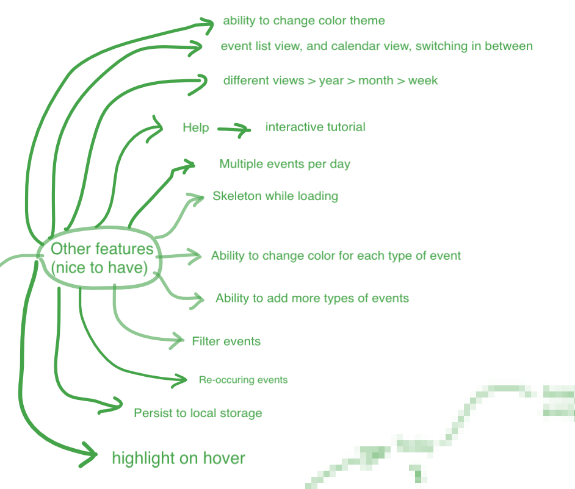

# React full year calendar

## 1. Forehead

Below I will outline:

- How start the local development server, run test, and build the project
- Summary on the given objectives
- My analysis for the given problem which goes into details of choice of data structure, the "ideal process", choice of technology
- How I structure the code and why I structure it in the way I do
- A little more on the design, design concept, and design systems

This project was bootstrapped with [Create React App](https://github.com/facebook/create-react-app).

## 2. Running the code - THE BUILD VERSION RUNS A LOT FASTER!

In the project directory, you can run:

### `npm start`

Runs the app in the development mode.<br>
Open [http://localhost:3000](http://localhost:3000) to view it in the browser.

### `npm test`

Launches the test runner in the interactive watch mode.<br>

### `npm run build`

Builds the app for production to the `build` folder.<br>

## Objectives

The main objectives are summarized below.

### **`achieved`** Render yearly view:
* All months
* Dates labelled with Mon-Sun on top
* All dates arranged so that it is clear to see which day of the week it is






### **`achieved`** By default today date should be distinguishable from the rest of the days


### **`achieved`** Ability to mark date as one of the following categories and each should have a different color:
  + Holiday
  + Birthday
  + Busy
  + Anniversary
  


  
### **`achieved`** Ability to remove special categories from the date


### **`achieved`** Ability to move between year without losing data




## 3. Analysis

### Concept
The app has an `<App/>` component that contains all other components, as well as the state of the program.
Inside it, the data of days and events are distributed into 12 calendar month components `<MonthCalendar/>`.
Component '<MonthCalendar/>' then renders all the date components `<DayBoxGroup/>` with color coded events, and align them depending to which day of the week it is (Monday, Tuesday...)
Finally, the `<Header/>` component which contains navigation `<Button/>` allows for changing the calendar year, as well as displaying which year it is in the `<Header.h1/>` component.



I made a wide frame and initially I planned to build a component appears when I hovers around each the of the 
`<DayBoxGroup/>` component. I later realize this can be a litter harder that I thought it would be because I need 
to have built in logic to decide whether to render on top, below or on the sides based on 
the screen room. Thus, I ended up adopting 3rd party component `react-responsive-modal` because of ease of customization. This component center around the avaiable screen and dim unfocused background.

### Data structure to store the date and events
I have consider using either a self-implemented Hash-map for storing event date to get `O(1)` look up time.
However, `Javascript Object()` is just as good because it also implement constant look up time. The storage overhead is also lower than using a Hash-map.

The JSON below is an example of what an object that contain special events would look like:
* Today is 16/12/2018
* Birthday events are on 18/11/2018, and 18/11/2019
* Anniversary events are on 16/12/2018, and 16/12/2019
```js
{
  "2018-11-18":["BIRTHDAY"],
  "2018-12-16":["TODAY","ANNIVERSARY"],
  "2019-11-18":["BIRTHDAY"],
  "2018-12-16":["ANNIVERSARY"]
}
```

When user add another busy event on 17/11/2018, it becomes
```js
{
  "2018-11-18":["BIRTHDAY"],
  "2018-12-16":["TODAY","ANNIVERSARY"],
  "2018-12-17":["BUSY"],
  "2019-11-18":["BIRTHDAY"],
  "2018-12-16":["ANNIVERSARY"]
}
```

The `value` for each `key` in the object is an array because the `value` might need to contain both `"TODAY"` and other events, for instance `"ANNIVERSARY"`.

As for the skeleton of each month, the dates which belong to a month are generated via a `O(N)` time complexity algorithm in which `N` is the number of month. The algorithm only ask `moment.js` once that which day is the 1st of that month (Monday, Tuesday...), and increment the array that store all the days accordingly.
The space complexity grows linearly with the number of month, and times `42` (6 x 7) to be exact. The maximum number of rows for this arrangement is `6` for the maxmimum of `31` days to be arranged. Each month having exactly `6` rows will eliminate any visual mismatch that may appear later on.



The data for the skeleton are stored in a array with exactly 42 items.
```js
[
  "empty","empty","empty","empty","2018-03-01","2018-03-02","2018-03-03",
  ...,
  "2018-03-25","2018-03-26","2018-03-27","2018-03-28","2018-03-29","2018-03-30","2018-03-31"
]
//length = 42
```

### Choice of technology


## 4. Code structure

```$xslt
src /
 "  /design system
 "  /components
 "  /logic
 "  /stories
```

`src` is the folder that contain all the relevant code. <br>

`src/design system/` contains the theme variables in `theme.js`, and the most basics components which are expected to be reused throughout the application ([Design System](https://www.invisionapp.com/inside-design/guide-to-design-systems/)). These components may be used in all the apps throughout your enterprise. This folder also contain a mix of **unit tests** and **integration tests** (might move to `__test__` folder later on)<br>

`src/components/` contains the components which overwrite the logic and styling of components from `src/design system/` so they are fit to be used for the exercise. These may be used only for this particular app.<br>

`src/logic` contains the helper functions and constant that may only apply to this particular exercise.

`src/stories` contains an interactive UI component library for developing components in isolation. Check out [storybook](https://github.com/storybooks/storybook).

## 5. The journey

### I try to "organically grow" my components
One in eight open source projects have some sort of vulnerability. Each one of they may use a different styling engine, be it pure CSS, SASS, LESS, or CSS-in-JS. 
It can hard to keep track of the changes and customization inherent for each of the external libraries.
Thus, depending on some components on the internet that someone builds for their hobby should be avoided. Few people actually use and test them. Rather, companies should try to learn how to build the compnents from the open source projects.

One thing that bugs me about developing with React is that components are generally not reusable enough.
It is because components are often embedded with their unique styling and logic. Therefore, the most basics building blocks are not consistent.

The way I went about doing this is to build my own `Design System` from ones that I like. 
It may take sometimes to read opensource code and understand what I like to keep and what I like to change. However, it is av ery worthy investment for the long term ([Source](https://airbnb.design/building-a-visual-language/)). More and more companies are building their own Design System (Priceline, Microsoft, DropBox, Instacart ....). Not having to rework the responsive system for each of the components, and having static shortcut for styling are two in many benefits that a `Design System` can offer.

Another thing I noticed that I should do properly from the start of the exercise is how make sure all the boxes are perfectly aligned and responsive.
I have always been curious on how to build a design system, and I took this opportunity to explore.
As I expected, having a programmable responsive structure powered by a `Design System`  turned out fantastic.

The library that offered a programmable responsive system is [styled-system](https://github.com/jxnblk/styled-system).
I also learned a lot on how to build a `Design System` from [Priceline Design System](https://github.com/pricelinelabs/design-system) and [Hackclub Design System](https://github.com/hackclub/design-system).

### Fine tuning
I initially tried to make the app just to work, then work fast, then work beautifully.

The part where I made it look better is self-explanatory, I just went and change some CSS-in-JS or add some `@keyframes`. 

When the app were fully functional, each time a date change its type of event (Busy/Holiday ...), it takes roughly *500ms* on my laptop. 
One solution that I have considered is to use `React shouldComponentUpdate()` to prevent excessive updates.
However, the  `React` comes with `PureComponent` which automatically looks for `props & state` changes. I choose this solution instead because of its simplicity and robustness.
After changing to `PureComponent` for smaller components which have their own `state` & `props` such as`<MonthCalendar />`, the app state changes significantly improved in speed. 
Now, each changes to the date events takes less than *200ms* which is acceptable considering the `<App/>` component keeps a hold of all days of the year, including the events.

One part where the performance can still improve is when the user switches year. All the days are positioned differently in each `<MonthCalendar/>` whent the year changes.
This causes almost all the `<DayBoxGroup/>` components to rerender and there is no solution obvious to me to shorten this render step.
I have already investigated whether generating the position of `<DayBoxGroup/>` cause an issue, but this skeleton building step takes less than *10ms*.
Another `React` library that I looked into also has this problem.
[React-yearly-calendar](https://github.com/BelkaLab/react-yearly-calendar) also takes roughly *500ms*
 to render when user change the year. **If you have a solution to improving this please do let me know.**
 
 **CORRECTION: in the final build, the delay to move between pages is much shorter (200ms), so maybe this is not an issue. But I like to have feedback.**



### Other features that I would implement if given more time


### How much time
Here is how much time it took me:
* Think about the problem & planning: `~1h`
* Work on the design system: `~3h`
* Work on the actual app building & problem solving: `~6h`
* Writing tests: `~2h` **(I have done some unit and integration tests but not all, like what should happens when the year changes or is it rendering special day correctly)**
* Writing docs + storybook: `~3h`
* Random related stuff: `~2h`

# Thank you! I look forward to your feedback.
